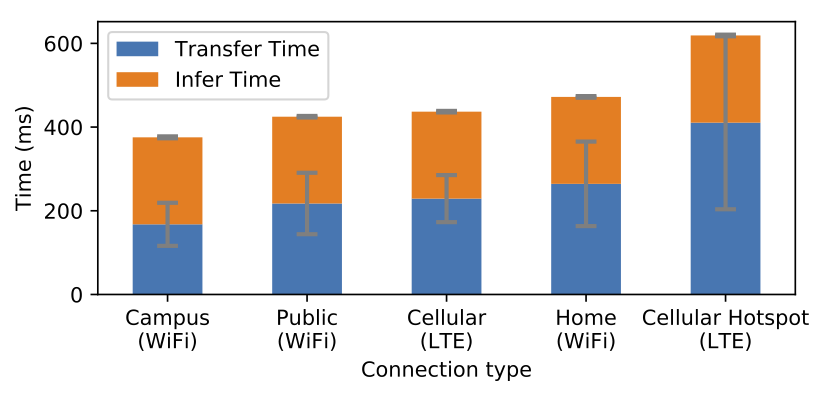
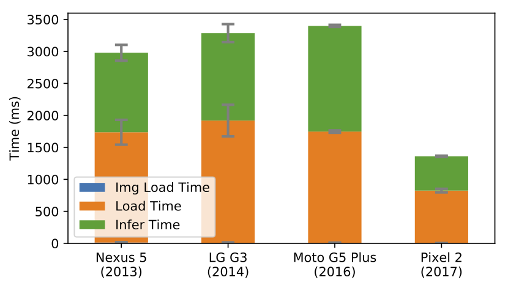

# MODI Benchmark App

MODI is a [Cake Lab](https://cake-lab.github.io/) project to leverage dynamic inference location selection to meet SLAs and increase accuracy whenever possible.
This benchmark application was developed to support the research presented in [MODI: Mobile Deep Inference Made Efficient by Edge Computing](https://www.usenix.org/conference/hotedge18/presentation/ogden).

Deep Learning Inference is increasing in popularity for mobile applications, allowing them to leverage new features like speech-to-text and image classification.
In order to better explore this problem space this benchmark application was developed to test variations on local and remote inference.

Included are an Android application (in `MODI_android`) and a simple inference server (in `Server`).

## Project Background

MODI aims to improve the performance of deep learning inference for mobile devices.
It accomplishes this by providing a number of models to dynamically select from at runtime, storing a wider selection of models at edge servers and managing a central repository of models that can be pushed to edge servers and then to mobile users as needed.
In the [MODI paper](https://www.usenix.org/conference/hotedge18/presentation/ogden) we introduce our vision for this system.
This application was used for benchmarking on-device and cloud-based performance.

### Motivation


#### Network Latency
---

<!---->
<div align="center"></div>

***Mobile Network Latency and Variation*** *Mobile Devices experience large variation between network types and even between different requests using the same network.  This variation makes cloud-based inference potentially more unpredictable.*

---

Communication from mobile devices to the cloud can be difficult due to the wide variety of networks that mobile devices use and the variation they experience.
Therefore, in order to provide good user experience, it is important to make run-time decisions for inference location and the model used for inference.

#### On-device Latency
---

<!---->
<div align="center"></div>

***On-device Inference Latency*** *On-device inference latency depends heavily on the phone capabilities.  Newer phones can perform better but many older devices experience large latency.*

---

On-device inference is not a panacea solution as on-device inference can take unacceptably long times on mobile devices, as is shown above.
Furthermore, on some devices on-device inference can have high variability.
Much of this latency is due to model load time, so improving on-device management can improve overall performance greatly, but not entirely resolve the problems.

### Proposed Solution

---

<!---->
<div align="center"></div>

***MODI System Design*** *The proposed layout of the MODI system leverages three tiers of model locations and execution options to provide and pick the best model for a given inference.*

---

The MODI system is designed to enable mobile devices to make the decision to run inference locally or remotely.
It makes use of a tiered architecture to enable the most relevant models to be pushed to the edges and supplied to the mobile devices and models statistics to be filtered upwards to be centrally collated to provide the best model runtime decisions.


## Getting started

### Test Images

There are a number of test images included in `MODI_android/app/src/main/assets/test_images`.
These images are organized such that images are in a subfolder named after their ground-truth class.
Images are a subset of a larger set that consists of images from  the [TensorFlow For Poets](https://codelabs.developers.google.com/codelabs/tensorflow-for-poets/#0) project and other images in the same categories.

### Local Inference
To use local inference models need to be added to the assets folder located at `MODI_android/app/src/main/assets/models`.
These models should be in TensorFlow's Frozen ProtoBuf file format, which are available on the [TensorFlow website](https://www.tensorflow.org/lite/guide/hosted_models).
Additionally, the `LocalClassifier.java` file should be updated to reflect the models being used.

### Remote Inference
To run the remote inference run a server that presents a POST API that accepts images as inputs.
An example server has been included in `Sample_Server/FlaskServer.py`

This server runs using python3 and relevant requirements can be found in `Sample_Server/requirements.txt`

### Requirements

Local inference requires Android API 23 or above.

## Related projects

Other projects can be found at [The Cake Lab's Project Site](https://cake-lab.github.io/projects/).

## References 

We ask that academic works which use this code reference the AdaptSize paper:
```
@inproceedings {216771,
author = {Samuel S. Ogden and Tian Guo},
title = {{MODI}: Mobile Deep Inference Made Efficient by Edge Computing},
booktitle = {{USENIX} Workshop on Hot Topics in Edge Computing (HotEdge 18)},
year = {2018},
address = {Boston, MA},
url = {https://www.usenix.org/conference/hotedge18/presentation/ogden},
publisher = {{USENIX} Association},
month = jul,
}
```

More publication details can be found on the [conference page](https://www.usenix.org/conference/hotedge18/presentation/ogden).

## Contact

* Samuel S. Ogden [ssogden@wpi.edu](mailto:ssogden@wpi.edu)

## Acknowledgments

This work is supported in part by NFS Grant CNS-1755659.
